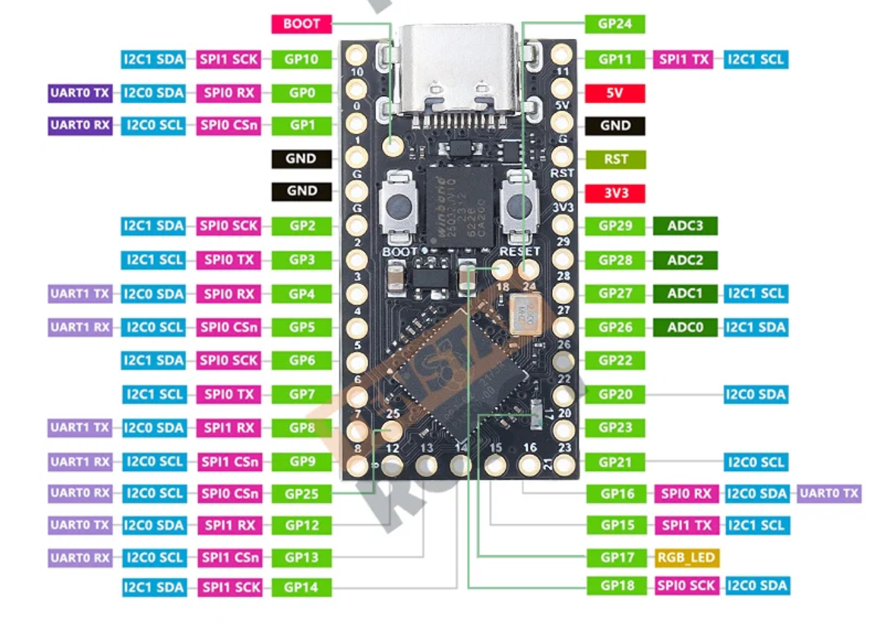
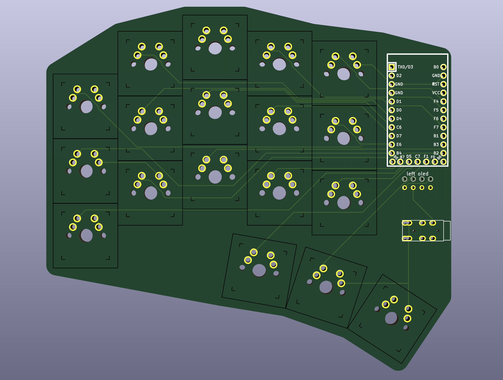

# Introduction

I decided to try my hand at designing a keyboard.

## Requirements

- Diodeless(cause SMD soldering/desoldering is pain)
- 36 keys
- MX switches(south facing)
- LED screens are optional but fun
- Support RP2040 (elite-pi or knock-offs, PINS should match), because cheap and popular.

  

- Reversible PCB

## Steps

- I first created a layout using [ergogen], I started with [ferris sweep] since feels familiar.(not sure how comfortable the layout will be with MX switches)
- Saw this cool repository called [sweeeeep/sweep36], choose this since it was 36 keys already, supported elite-pi, and bonus! LED screen!! 😎
- Using MCU/TRRS/LED footprints from that sweep36, now we build this keyboard.(not sure what to call it)
- Best part is the [QMK firmware] for the sweep36 is already created, so I will just use that directly with this board.
- Then use another awesome community tool in [kicad] called [freerouting]
- TADA! This is the final product.

  

> DISCLAIMER: I don't know anything, use this at your own risk I am not liable to anything.

[ergogen]: https://ergogen.cache.works/
[ferris sweep]: https://github.com/davidphilipbarr/Sweep
[sweeeeep/sweep36]: https://github.com/sadekbaroudi/sweep36
[freerouting]: https://github.com/freerouting/freerouting
[kicad]: https://www.kicad.org/
[QMK firmware]: https://github.com/sadekbaroudi/qmk_firmware/tree/master/keyboards/fingerpunch/sweeeeep
